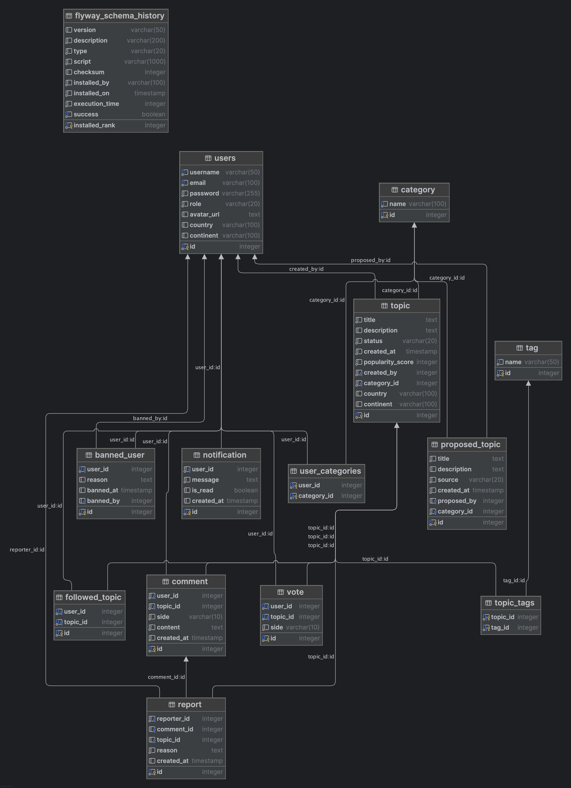

# 🧠 LeftOrRight ~ LOR

Aplikacja społecznościowa do binarnej debaty — użytkownicy wybierają stronę (lewą/prawą) w różnych tematach, dzielą się opiniami, przeglądają argumenty, a najpopularniejsze tematy wizualizowane są w formie „baniek mydlanych”.

---

## 📌 Spis Treści

- [Opis projektu](#-opis-projektu)
- [Funkcjonalności](#-funkcjonalności)
- [Technologie](#-technologie)
- [Instalacja](#-instalacja)
- [Schemat bazy danych](#-schemat-bazy-danych)
- [API](#-api)
- [Diagram ERD](#-diagram-erd)
- [Rozwój i TODO](#-rozwój-i-todo)
- [Autor](#-autor)

---

## 🧩 Opis projektu

LeftOrRight to interaktywna aplikacja internetowa do społecznych dyskusji i przeglądania argumentów "za" i "przeciw" w aktualnych, kontrowersyjnych lub popularnych tematach. Treści organizowane są w formie tematów reprezentowanych przez "bańki", których rozmiar zależy od ich popularności.

---

## ✨ Funkcjonalności

- Rejestracja i logowanie użytkowników (JWT, cookies)
- Wybór strony (lewa/prawa) + dodanie komentarza
- Przeglądanie tematów i argumentów bez logowania
- Obserwacja tematów
- Filtrowanie feedu wg kraju, kontynentu, kategorii
- Proponowanie nowych tematów (lub import z API)
- Głosowanie + aktualizacja popularności w czasie rzeczywistym
- Panel administratora (moderacja tematów, komentarzy, użytkowników)

---

## ⚙️ Technologie

### Backend:
- Java 21+
- Spring Boot
- Spring Data JPA
- Spring Security (JWT)
- PostgreSQL
- Maven

### Frontend:
- React *(planowane)*
- lub Thymeleaf *(tymczasowo lub fallback)*

### Inne:
- MapStruct
- Lombok
- WebClient (do integracji z zewnętrznym API)
- SLF4J (logowanie)
- Swagger (planowane)
- Docker *(planowane)*
- CI/CD *(planowane)*
- Flyway (migracje bazy danych)

---

## 🚀 Instalacja

```bash
git clone https://github.com/eloomati/left-or-right.git
cd left-or-right
```
🛠️ Inicjalizacja bazy danych
1. Zainstaluj Podmana.
2. Uruchom kontener z PostgreSQL:
```bash
  ./scripts/podman_start_postgres.sh
```
3. Zainicjalizuj bazę danych oraz użytkowników Flyway i aplikacji:
- Bez nazwy bazy (używana wartość domyślna):
```bash
  ./scripts/init_db.sh "" haslo_flyway haslo_app
```
- Z podaniem nazwy bazy (np. lor_test):
```bash
  ./scripts/init_db.sh lor_test haslo_flyway haslo_app
```
📌 Uwagi:
- Użytkownik migracji (Flyway) służy wyłącznie do wykonywania migracji (zmian w strukturze bazy danych).
- Użytkownik aplikacji jest używany przez aplikację w codziennej pracy z danymi.
- Hasła należy podać do skryptu czterokrotnie – domyślna wartość to admin

🔐 Jak uzyskać hasło aplikacji Gmail

1. Zaloguj się na swoje konto Google.
2. Wejdź na: https://myaccount.google.com/security
3. Włącz weryfikację dwuetapową (2FA), jeśli jeszcze nie jest włączona.
4. Po jej aktywacji przejdź do sekcji Hasła aplikacji.
5. Wybierz:
- Aplikacja: Poczta
- Urządzenie: Inne → wpisz np. SpringBoot
- Kliknij "Generuj" – skopiuj 16-znakowe hasło.

🛠️ Konfiguracja aplikacji

1. Utwórz plik .env na podstawie wzoru:
- Skopiuj plik env.example do .env w głównym katalogu projektu:
```
cp env.example .env
```
- Następnie uzupełnij plik .env swoimi danymi dostępowymi (hasła do bazy, klucz JWT, dane SMTP).

2. Uruchamianie aplikacji w IntelliJ IDEA:
- Otwórz konfigurację uruchomienia (Run/Debug Configurations).
- Zaznacz opcję Enable env file.
- Wskaż plik .env (jeśli nie widzisz plików ukrytych, użyj skrótu ⌘ + Shift + . lub wpisz .env ręcznie w polu ścieżki).
-  Zapisz konfigurację i uruchom aplikację.

3. Uruchamianie aplikacji w terminalu:
- Korzystaj z Mavena, uruchom aplikację poleceniem:
```
mvn spring-boot:run
```
- Upewnij się, że plik .env znajduje się w katalogu głównym projektu
- Jeśli zmienne nie są ładowane automatycznie, możesz załadować je ręcznie:
```
export $(grep -v '^#' .env | xargs) && mvn spring-boot:run
```

## 🧠 Schemat bazy danych

### Encje (tabele):
- users
- category
- user_categories (relacja many-to-many: użytkownik ↔ kategorie)
- topic
- vote
- comment
- followed_topic
- proposed_topic
- banned_user
- notification
- tag
- topic_tags (relacja many-to-many: temat ↔ tag)
- report

### Typy relacji:
- OneToMany: users ↔ comment, topic ↔ vote, users ↔ topic (created_by), users ↔ proposed_topic (proposed_by), users ↔ banned_user, users ↔ notification, users ↔ report (reporter_id)
- ManyToOne: topic ↔ category, proposed_topic ↔ category, comment ↔ topic, vote ↔ topic, followed_topic ↔ topic, report ↔ topic, report ↔ comment
- ManyToMany: users ↔ category (user_categories), topic ↔ tag (topic_tags)

## 📊 Diagram ERD



## 🧪 API
(W trakcie tworzenia – dodaj opis endpointów, np. login, rejestracja, dodaj komentarz, głosuj, pobierz tematy itd.)

Endpoint dla rejestracji użytkownika:
```
curl -v -X POST http://localhost:8080/api/users/register \
-H "Content-Type: application/json" \
-d '{"username":"tesstmati","email":"mateusz.hetko@autopay.pl","password":"TestPassword123"}'
```

## 📈 Rozwój i TODO
### 🔧 Sprint 1: Model danych
- Schemat bazy danych (JPA + PostgreSQL)
- Startery Maven
- ERD diagram

### 📦 Sprint 2: Backend funkcjonalny
- CRUD: User, Topic, Comment
- Rejestracja / Logowanie z JWT
- DTO i walidacja

### 💬 Sprint 3: Głosowanie i komentarze
- Obsługa głosów i komentarzy
- Liczenie popularności

### 🔒 Sprint 4: Panel administratora
- Usuwanie komentarzy, banowanie użytkowników
- Przenoszenie tematów

### 🌐 Sprint 5: Integracja z API
- Pobieranie tematów z DeepSeek

### 🎨 Sprint 6: Frontend + UI/UX
- Bańki tematyczne
- Responsywny layout
- Filtrowanie, wyszukiwarka

## 👨‍💻 Autor

- Kontakt: hetko.mateusz@gmail.com 
- GitHub: github.com/eloomati

